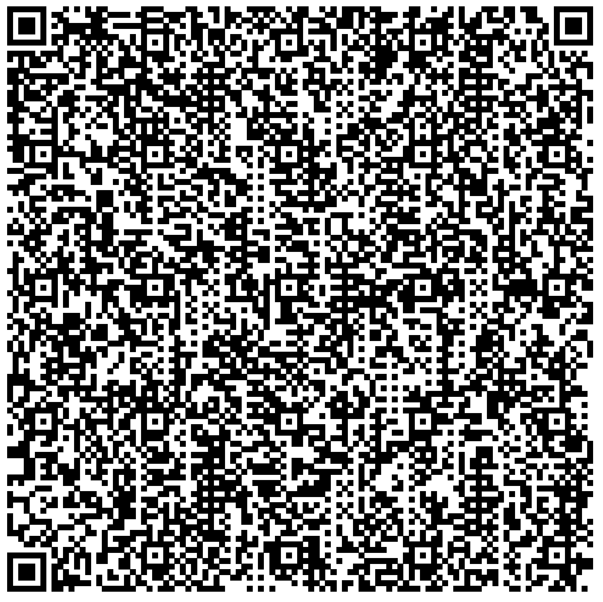

# shc-extractor

Extract and validate the JSON payload from SHC QR Codes (i.e Québec COVID Vaccination QR Codes)

### Introduction

Bientôt, le gouvernement du Québec mettra en place un passport vaccinal utilisant la preuve de vaccaination numérique (le fameux code QR). Ces codes QR sont généré avec le protocole Smart Health Cards (https://smarthealth.cards), fonctionnant l'aide de JWT (un système de jeton numérique généralement utilisé pour l'authentification d'APIs qui permet d'empêcher la falcification des codes QR). En bref, toutes les données de la preuve de vaccination sont directement encodées en JSON dans le contenu du code QR, puis signées avec une clé secrète. Cela permet par la suite de valider l'authenticité des données d'un code QR sans qu'il soit nécessaire de conserver une copie des données relatives aux personnes vaccinées sur un quelconque serveur. Or, puisque les données sont disponible dans le payload du code QR, il est possible d'extraire ces données afin de les consulter et de verifier leur authenticité.

Soon, the Quebec government will deploy a vaccination passport using the digital proof of immunization (the infamous QR code). These QR codes are generated through the Smart Health Cards protocol (https://smarthealth.cards), using JWT (a digital token system generally used for Web API authentication, that prevents QR code forgery). In short, all the relevant immunization data will be directly encoded as JSON in the QR code payload, and then signed with a secret key. This allows to validate the authenticity of the QR code data without the need to keep a copy of the vaccination data on any server. Since the data is available in the QR code payload, it is possible to extract this data in order to review it and verify its trustworthiness.

---

### ⚠️ Disclaimers

**FR :**

* Ce projet n'est pas affilié au Gouvernement du Québec.
* Cette application est destinée à des fins éducatives et ne fournit aucune garantie, y compris concernant la validation des données.
* Cette application ne doit pas être utilisée pour recueillir des données personnelles sans le consentement du propriétaire des données.

**EN :**

* This project is not affiliated with the Government of Quebec.
* This app is intended for educational purposes and do not provide any warranty of any kind including data validation.
* This app cannot be used to collect personal data without the consent of the owner of the QR code data.
* This app is intended for educational purposes.

---

## Usage 

```
git clone https://github.com/obrassard/shc-extractor.git
cd shc-extractor
npm install
node shc.js '/path/to/the/qrcode.png'
```

Where `'/path/to/the/qrcode.png'` is a path to the QR Code image (in PNG).

The extracted JSON will be saved in `./out`

---

### Credits and inspiration :

* https://github.com/dvci/health-cards-walkthrough/blob/main/SMART%20Health%20Cards.ipynb

* https://gist.github.com/remi/e3aa2f78845ee13f706ed83aead5145f

* Spcial thanks to @fproulx, who found the public key that allows validation of Qc Gov. QR Codes.

---

### Sample data

**./sample/sample-qr-code.png** :



**Extracted data** :
```
node shc.js './sample/sample-qr-code.png'
```

```json
{
    "header": {
        "zip": "DEF",
        "alg": "ES256",
        "kid": "3Kfdg-XwP-7gXyywtUfUADwBumDOPKMQx-iELL11W9s"
    },
    "payload": {
        "iss": "https://smarthealth.cards/examples/issuer",
        "nbf": 1620847989.837,
        "vc": {
            "type": [
                "https://smarthealth.cards#health-card",
                "https://smarthealth.cards#immunization",
                "https://smarthealth.cards#covid19"
            ],
            "credentialSubject": {
                "fhirVersion": "4.0.1",
                "fhirBundle": {
                    "resourceType": "Bundle",
                    "type": "collection",
                    "entry": [
                        {
                            "fullUrl": "resource:0",
                            "resource": {
                                "resourceType": "Patient",
                                "name": [
                                    {
                                        "family": "Anyperson",
                                        "given": [
                                            "John",
                                            "B."
                                        ]
                                    }
                                ],
                                "birthDate": "1951-01-20"
                            }
                        },
                        {
                            "fullUrl": "resource:1",
                            "resource": {
                                "resourceType": "Immunization",
                                "status": "completed",
                                "vaccineCode": {
                                    "coding": [
                                        {
                                            "system": "http://hl7.org/fhir/sid/cvx",
                                            "code": "207"
                                        }
                                    ]
                                },
                                "patient": {
                                    "reference": "resource:0"
                                },
                                "occurrenceDateTime": "2021-01-01",
                                "performer": [
                                    {
                                        "actor": {
                                            "display": "ABC General Hospital"
                                        }
                                    }
                                ],
                                "lotNumber": "0000001"
                            }
                        },
                        {
                            "fullUrl": "resource:2",
                            "resource": {
                                "resourceType": "Immunization",
                                "status": "completed",
                                "vaccineCode": {
                                    "coding": [
                                        {
                                            "system": "http://hl7.org/fhir/sid/cvx",
                                            "code": "207"
                                        }
                                    ]
                                },
                                "patient": {
                                    "reference": "resource:0"
                                },
                                "occurrenceDateTime": "2021-01-29",
                                "performer": [
                                    {
                                        "actor": {
                                            "display": "ABC General Hospital"
                                        }
                                    }
                                ],
                                "lotNumber": "0000007"
                            }
                        }
                    ]
                }
            }
        }
    },
    "verifications": {
        "trustable": true,
        "verifiedBy": "3Kfdg-XwP-7gXyywtUfUADwBumDOPKMQx-iELL11W9s"
    }
}
```
