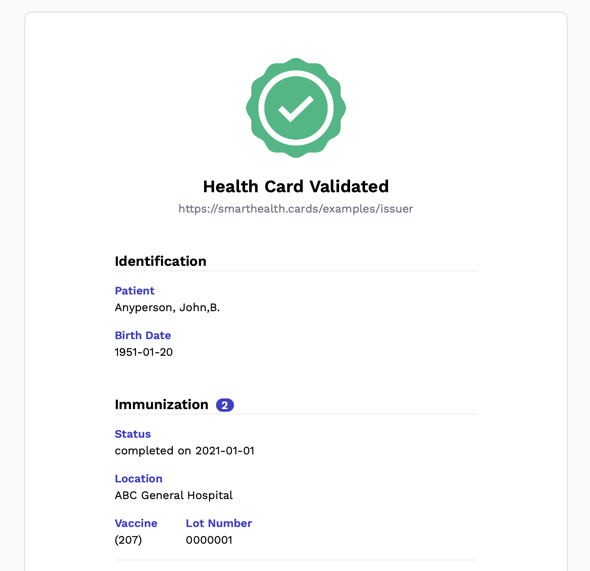

# shc-extractor

## Extract and validate the JSON payload from SMART Health Cards QR Codes.

> 🚩 L'objectif de ce projet est le décodage des SHC. **S'il vous plait, ne me sollicitez pas pour générer des codes QR personnalisés à partir d'un fichier JSON.** Cela ne fonctionnera pas car la signature des codes QR personnalisés ne sera pas vérifiée par les applications de validation officielles

> 🚩The purpose of this project is SHC decoding. **Please do not ask me to generate custom QR codes from a JSON file.** It won't work since the signature of custom QR codes won't be accepted by official validation apps.

For more information please refer to [FAQ about shc-extractor](https://github.com/obrassard/shc-extractor/discussions/26).

---

### Introduction

Plusieur provinces et territoires canadien ont mis en place un système passeport vaccinal utilisant une preuve de vaccaination numérique (le fameux code QR) afin de luter contre la propagation de la COVID-19. Ces codes QR sont généré avec le protocole Smart Health Cards (https://smarthealth.cards), fonctionnant l'aide de JWT (un système de jeton numérique généralement utilisé pour l'authentification d'APIs qui permet d'empêcher la falcification des codes QR). En bref, toutes les données de la preuve de vaccination sont directement encodées en JSON dans le contenu du code QR, puis signées avec une clé secrète. Cela permet par la suite de valider l'authenticité des données d'un code QR sans qu'il soit nécessaire de conserver une copie des données relatives aux personnes vaccinées sur un quelconque serveur. Or, puisque les données sont disponible dans le payload du code QR, il est possible d'extraire ces données afin de les consulter et de verifier leur authenticité.

Several Canadian provinces and territories have introduced a vaccination passport system using digital proof of vaccination (the infamous QR code) to help prevent COVID-19 spread. These QR codes are generated through the Smart Health Cards protocol (https://smarthealth.cards), using JWT (a digital token system generally used for Web API authentication, that prevents QR code forgery). In short, all the relevant immunization data will be directly encoded as JSON in the QR code payload, and then signed with a secret key. This allows to validate the authenticity of the QR code data without the need to keep a copy of the vaccination data on any server. Since the data is available in the QR code payload, it is possible to extract this data in order to review it and verify its trustworthiness.


#### 🇨🇦 Now supporting new provinces and territories! 🇨🇦

SHC-extractor now supports QR codes decoding for the following provinces and territories :

* Québec
* British Columbia
* Saskatchewan
* Alberta
* Newfoundland and Labrador
* Nova Scotia
* Ontario
* Northwest Territories
* Yukon
* New Brunswick/Nouveau-Brunswick
* Japan

---

### ⚠️ Disclaimers

**FR :**

* Ce projet n'est pas affilié au Gouvernement du Québec, ni à aucun gouvernement de Province ou Territoire canadien.
* Cette application est destinée à des fins éducatives et ne fournit aucune garantie, y compris concernant la validation des données.
* Cette application ne doit pas être utilisée pour recueillir des données personnelles sans le consentement du propriétaire des données. En outre, elle ne doit pas être utilisée à des fins de vérification des preuves vaccinales dans le cadre de la loi sur les passeports de vaccination dans une province ou un territoire canadien. **Les commerçants doivent utiliser l'application officielle mise à leur disposition dans leur juridiction.**
* Le développeur de cette application se détache de toute responsabilité lié à un usage illégal de l'application par une tierce personne.

**EN :**

* This project is not affiliated with the Government of Quebec, nor any other government of canadian province or territory.
* This app is intended for educational purposes and do not provide any warranty of any kind including data validation.
* This application should not be used to collect personal data without the consent of the data owner. Furthermore, it cannot be used for verifying proof of vaccination in the context of the law on vaccination passports in any Canadian province or territory. **Merchants and venue owners must use the official application for their jurisdiction.**
* The developer of this application disclaims any responsibility for illegal use of the application by a third party.

---

## Usage 

```
git clone https://github.com/obrassard/shc-extractor.git
cd shc-extractor
npm install
node shc.js '/path/to/the/qrcode.png'
```

Where `'/path/to/the/qrcode.png'` is a path to the QR Code image (in PNG).

The extracted JSON will be saved in `./out`

---

### :star: NEW : Visualize QR code data in a more friendly way using the Web UI

Why reading a JSON file when you can visualize your QR code data in a cute Web UI?



**How ?**

```
GET {host}/card?shc={shc-raw-content}
```

You can try it with the sample QR code (or your own) on the live demo page : https://shc.obrassard.ca *(no data is collected or stored by this server)*. On the main page, you'll be prompted to scan a QR code to decode.


:bulb: **Tip** : If you have an iOS device, you can also use this shortcut to scan the QR code and quickly open the Web UI : https://www.icloud.com/shortcuts/435d6706c43e45e4a9b78e700bdfcdf8

If you prefer you may use it locally using the following commands :

```
npm install
npm start

# Then navigate to :
GET http://localhost:1234/
```

> Note that some browsers may not let you access the camera if you are not using https.

---

### Credits and inspiration :

* https://github.com/dvci/health-cards-walkthrough/blob/main/SMART%20Health%20Cards.ipynb

* https://gist.github.com/remi/e3aa2f78845ee13f706ed83aead5145f

* Special thanks to @fproulx, who found the public key that allows validation of Qc Gov. QR Codes.

---

### Sample data

**./sample/sample-qr-code.png** :


**Extracted data** :
```
node shc.js './sample/sample-qr-code.png'
```

```json
{
    "header": {
        "zip": "DEF",
        "alg": "ES256",
        "kid": "3Kfdg-XwP-7gXyywtUfUADwBumDOPKMQx-iELL11W9s"
    },
    "payload": {
        "iss": "https://smarthealth.cards/examples/issuer",
        "nbf": 1620847989.837,
        "vc": {
            "type": [
                "https://smarthealth.cards#health-card",
                "https://smarthealth.cards#immunization",
                "https://smarthealth.cards#covid19"
            ],
            "credentialSubject": {
                "fhirVersion": "4.0.1",
                "fhirBundle": {
                    "resourceType": "Bundle",
                    "type": "collection",
                    "entry": [
                        {
                            "fullUrl": "resource:0",
                            "resource": {
                                "resourceType": "Patient",
                                "name": [
                                    {
                                        "family": "Anyperson",
                                        "given": [
                                            "John",
                                            "B."
                                        ]
                                    }
                                ],
                                "birthDate": "1951-01-20"
                            }
                        },
                        {
                            "fullUrl": "resource:1",
                            "resource": {
                                "resourceType": "Immunization",
                                "status": "completed",
                                "vaccineCode": {
                                    "coding": [
                                        {
                                            "system": "http://hl7.org/fhir/sid/cvx",
                                            "code": "207"
                                        }
                                    ]
                                },
                                "patient": {
                                    "reference": "resource:0"
                                },
                                "occurrenceDateTime": "2021-01-01",
                                "performer": [
                                    {
                                        "actor": {
                                            "display": "ABC General Hospital"
                                        }
                                    }
                                ],
                                "lotNumber": "0000001"
                            }
                        },
                        {
                            "fullUrl": "resource:2",
                            "resource": {
                                "resourceType": "Immunization",
                                "status": "completed",
                                "vaccineCode": {
                                    "coding": [
                                        {
                                            "system": "http://hl7.org/fhir/sid/cvx",
                                            "code": "207"
                                        }
                                    ]
                                },
                                "patient": {
                                    "reference": "resource:0"
                                },
                                "occurrenceDateTime": "2021-01-29",
                                "performer": [
                                    {
                                        "actor": {
                                            "display": "ABC General Hospital"
                                        }
                                    }
                                ],
                                "lotNumber": "0000007"
                            }
                        }
                    ]
                }
            }
        }
    },
    "verifications": {
        "trustable": true,
        "verifiedBy": "3Kfdg-XwP-7gXyywtUfUADwBumDOPKMQx-iELL11W9s"
    }
}
```
